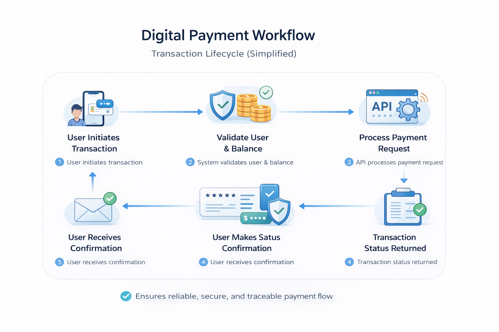

# 💳 Fintech Payments Application Documentation

## 🧩 Case Study: Fintech App Documentation

### 🧠 Problem

Users struggle with understanding digital payment workflows and transaction steps.

### 💡 Solution

Created structured documentation combining:

* User guides
* API documentation
* Workflow explanations

## 🎯 Outcome

* Improved clarity for onboarding users
* Reduced confusion in transactions
* Created scalable documentation structure

## 🚀 Overview

This project simulates real-world documentation for a **digital payments fintech application**.

It demonstrates how technical writing improves:

* User onboarding
* Feature clarity
* System usability

## ⚙️ Key Features

* Secure user authentication
* Real-time money transfer
* Transaction history tracking
* Error handling and retry mechanisms
* API-driven payment processing

## 🔄 System Flow (Transaction Lifecycle)

1. User initiates transaction
2. System validates user & balance
3. API processes payment request
4. Transaction status returned
5. User receives confirmation

👉 Ensures reliable, secure, and traceable transaction lifecycle for end users

## 📊 Transaction Flow Diagram

---

## 🧭 Product Description

The application allows users to:

* Create an account
* Add bank details
* Send & receive money
* Track transactions

---

## 👥 Target Users

* General users
* First-time digital payment users
* Mobile app users

---

## 📘 User Guide

### 🔐 Account Registration

1. Open the app
2. Enter mobile number
3. Verify OTP
4. Set password

---

### 💸 Send Money

1. Select "Send Money"
2. Enter recipient details
3. Enter amount
4. Confirm transaction

---

### 📊 Transaction History

* View all past transactions
* Filter by date
* Download reports

---

## 🔌 API Documentation

### Endpoint: /login  
**Method:** POST  

Request:
{
  "mobile": "string",
  "otp": "1234"
}

Response:
{
  "status": "success",
  "token": "abc123"
}

---

### Endpoint: /balance  
**Method:** GET  

Response:
{
  "balance": 5000
}

---

### Endpoint: /transaction-history  
**Method:** GET  

Response:
{
  "transactions": [
    {
      "id": "TXN123",
      "amount": 500,
      "status": "success"
    }
  ]
}
---

## ⚠️ Error Handling

### Common Errors

| Code | Meaning | Solution |
|------|--------|---------|
| 400  | Bad Request | Validate input |
| 401  | Unauthorized | Re-login |
| 500  | Server Error | Retry after some time |

---

### Retry Mechanism

- Allow users to retry failed transactions  
- Show clear error messages  
- Maintain transaction logs  

👉 Improves reliability and user trust

## 🧠 Documentation Strategy

* Task-based structure
* Clear step-by-step instructions
* Scannable formatting
* Real-world usability focus

---

## 🎯 Value

This documentation demonstrates:

* End-to-end product understanding
* User-focused writing
* API + user guide integration
* Structured content design

---

## ⚠️ Real-World Scenario: Failed Transaction

### Issue

User initiates payment but transaction fails.

### Possible Reasons

* Insufficient balance
* Network failure
* Server timeout

### Solution Steps

1. Check account balance
2. Retry transaction
3. Verify network connection
4. Contact support if issue persists

👉 Helps reduce support queries and improves user trust

---
## 📊 User Flow (Simplified)

User Journey:

1. Register account
2. Add bank details
3. Send money
4. Receive confirmation
5. View transaction history

👉 Designed for smooth onboarding experience

---

## 🎯 Real-World Impact

This documentation helps:

* Reduce user confusion
* Improve onboarding speed
* Minimize support queries

---

## 🧠 What Makes This Strong

* Combines user guide + API docs
* Focuses on real user actions
* Structured for quick understanding

## 🧠 Challenges Faced

- Users fail transactions due to unclear steps  
- Lack of clarity in error messages  
- No visibility into transaction flow  

---

## 🛠️ Decisions Made

- Introduced step-by-step transaction lifecycle  
- Added real-world failure scenario  
- Simplified API representation  

---

## 📈 Impact

- Reduced user confusion  
- Improved onboarding clarity  
- Better understanding of transaction flow  

## 💡 Why This Documentation Matters

Effective documentation in fintech systems plays a critical role in:

- Reduces transaction errors  
- Improves user trust  
- Decreases support queries  
- Enhances overall product experience  

## 👤 Author

Naeem Mansuri | 
Software Technical Writer @ Cognizant
